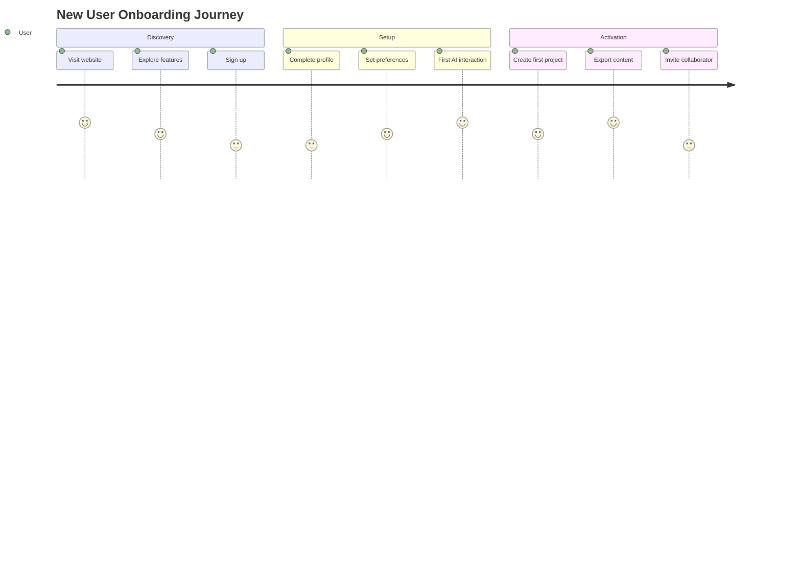
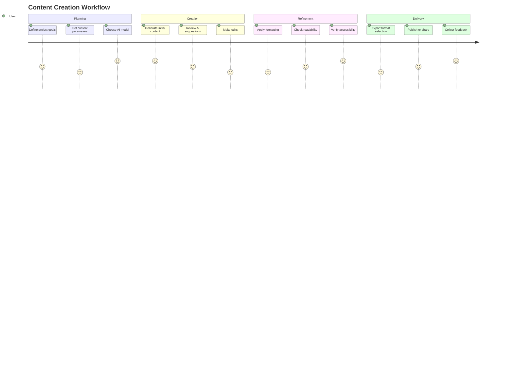

# ContentSplit UX Experience Strategy

## Overview

The ContentSplit UX Experience Strategy defines the holistic user experience approach for the application. This goes beyond individual UI components to encompass user journeys, emotional design, accessibility, and the overall experience ecosystem. The strategy aligns with Google Material Design 3 principles while establishing ContentSplit's unique identity.

## UX Vision Statement

> "To create intuitive, accessible, and delightful experiences that empower users to work with AI content effortlessly, building trust through clarity and reliability."

## Core Experience Principles

### 1. Clarity Over Cleverness
- Prioritize clear communication over decorative design
- Use familiar patterns users already understand
- Provide immediate value with minimal cognitive load
- Ensure every UI element has a clear purpose

### 2. Trust Through Transparency
- Be honest about AI capabilities and limitations
- Show what's happening behind the scenes
- Provide explanations for AI decisions when possible
- Build confidence through reliability and consistency

### 3. Empowerment Through Control
- Give users control over AI interactions
- Provide clear undo/redo capabilities
- Allow customization of AI behavior
- Support user preferences and accessibility needs

### 4. Delight Through Details
- Add thoughtful micro-interactions
- Provide positive reinforcement for successful actions
- Create smooth, purposeful animations
- Pay attention to loading states and transitions

## User Experience Framework

### The 5E Framework
1. **Engage** - Capture user interest and demonstrate value quickly
2. **Empower** - Provide tools and controls for effective AI interaction
3. **Educate** - Teach users how to use AI features effectively
4. **Enable** - Remove barriers and streamline workflows
5. **Enchant** - Create moments of delight that build loyalty

## User Personas

### Primary Persona: Content Creator Chloe
**Demographics:**
- Age: 28-45
- Profession: Marketing manager, content strategist, blogger
- Tech Savviness: Intermediate
- Goals: Produce high-quality content efficiently, maintain brand voice, scale content production

**Needs:**
- Quick content generation and editing
- Consistency with brand guidelines
- Easy collaboration with team members
- Reliable AI that understands context
- Export options for various platforms

### Secondary Persona: Technical User Taylor
**Demographics:**
- Age: 25-40
- Profession: Developer, technical writer, product manager
- Tech Savviness: Advanced
- Goals: Technical documentation, API integration, structured content

**Needs:**
- Precision in AI responses
- Code formatting and syntax highlighting
- API integration capabilities
- Markdown export
- Version control integration

### Tertiary Persona: Accessibility Advocate Alex
**Demographics:**
- Age: 30-50
- Profession: Accessibility consultant, inclusive design advocate
- Tech Savviness: Intermediate to Advanced
- Goals: Ensure content accessibility, inclusive design patterns

**Needs:**
- Accessibility-first design
- Screen reader compatibility
- Keyboard navigation
- Color contrast compliance
- Alternative text generation

## User Journey Mapping

### Onboarding Journey


### Core Workflow Journey


## Emotional Design Framework

### Emotional States to Design For

| Emotional State | Design Response | Example Implementation |
|-----------------|-----------------|------------------------|
| **Frustration** | Simplify, guide, provide alternatives | Clear error messages, undo options, helpful tooltips |
| **Confusion**   | Clarify, educate, show examples | Onboarding tours, contextual help, example templates |
| **Uncertainty** | Reassure, provide feedback, show progress | Loading states, success confirmation, progress indicators |
| **Delight**     | Celebrate, surprise, add polish | Micro-interactions, smooth animations, positive reinforcement |
| **Trust**       | Be transparent, consistent, reliable | Clear explanations, consistent behavior, reliable performance |

### Emotional Touchpoints
1. **First Impression** - Clean, professional, inviting interface
2. **First Success** - Celebratory feedback for first completed task
3. **Error Recovery** - Supportive, helpful error resolution
4. **Task Completion** - Satisfying completion animations and next steps
5. **Learning Moments** - Helpful guidance when trying new features

## Accessibility Experience Strategy

### Beyond Compliance
- Design for cognitive accessibility (clear language, simple workflows)
- Support motor accessibility (large touch targets, keyboard navigation)
- Consider sensory accessibility (multiple feedback modes)
- Address emotional accessibility (reduce anxiety, build confidence)

### Inclusive Design Patterns
```css
/* Inclusive focus styles */
:focus-visible {
  outline: 3px solid var(--sys-color-primary-40);
  outline-offset: 2px;
}

/* High contrast mode support */
@media (prefers-contrast: high) {
  .button-primary {
    border: 2px solid currentColor;
  }
}

/* Reduced motion preferences */
@media (prefers-reduced-motion: reduce) {
  * {
    animation-duration: 0.01ms !important;
    animation-iteration-count: 1 !important;
    transition-duration: 0.01ms !important;
  }
}
```

### Accessibility User Testing
- Regular testing with screen readers (NVDA, VoiceOver, JAWS)
- Keyboard navigation testing without mouse
- Color contrast verification with diverse visual abilities
- Cognitive walkthroughs with neurodiverse participants

## AI Interaction Design Principles

### 1. Explainable AI
- Show confidence scores for AI suggestions
- Provide reasoning for AI decisions when possible
- Allow users to see alternative AI responses
- Be transparent about AI limitations

### 2. Controllable AI
- Provide granular control over AI parameters
- Allow users to adjust AI "creativity" or "precision"
- Support user preferences for AI behavior
- Implement easy undo/redo for AI actions

### 3. Collaborative AI
- Position AI as a collaborative tool, not a replacement
- Design interactions that feel like partnership
- Allow users to guide and correct AI
- Support iterative refinement with AI assistance

### 4. Ethical AI
- Clearly label AI-generated content
- Provide content moderation tools
- Support user control over data usage
- Implement bias mitigation strategies

## Performance Experience

### Perceived Performance
- **0-100ms**: Feels instantaneous
- **100-300ms**: Feels fast but noticeable
- **300-1000ms**: Feels like a task is happening
- **1-3 seconds**: User starts to lose focus
- **3+ seconds**: User may abandon task

### Loading Experience Strategy
```css
/* Progressive loading states */
.skeleton-loading {
  background: linear-gradient(90deg, 
    var(--sys-color-neutral-95) 25%, 
    var(--sys-color-neutral-98) 50%, 
    var(--sys-color-neutral-95) 75%);
  background-size: 200% 100%;
  animation: loading 1.5s infinite;
}

@keyframes loading {
  0% { background-position: 200% 0; }
  100% { background-position: -200% 0; }
}

/* Content priority loading */
.content-priority {
  /* Load critical content first */
}

.content-secondary {
  /* Load after critical content */
}
```

### Performance Budget
- **First Contentful Paint**: < 1.5 seconds
- **Time to Interactive**: < 3 seconds
- **Largest Contentful Paint**: < 2.5 seconds
- **Cumulative Layout Shift**: < 0.1
- **First Input Delay**: < 100ms

## Content Strategy

### Voice and Tone
| Context | Voice | Tone |
|---------|-------|------|
| **Onboarding** | Helpful, encouraging | Warm, supportive |
| **Instructions** | Clear, direct | Confident, precise |
| **Errors** | Helpful, constructive | Calm, reassuring |
| **Success** | Celebratory, proud | Energetic, positive |
| **AI Interactions** | Collaborative, intelligent | Helpful, capable |

### Content Guidelines
- Use active voice
- Keep sentences short (15-20 words max)
- Use simple, clear language
- Avoid jargon unless defined
- Be consistent with terminology
- Provide examples when helpful

### Microcopy Examples
```javascript
const microcopy = {
  // Empty states
  emptyProjects: "Start your first project to create amazing content with AI",
  emptyResults: "Try adjusting your search terms or filters",
  
  // Loading states
  loading: "Getting things ready...",
  saving: "Saving your changes...",
  processing: "AI is thinking...",
  
  // Success messages
  saved: "All changes saved successfully",
  exported: "Content exported and ready to use",
  published: "Your content is now live!",
  
  // Error recovery
  retry: "Try again",
  learnMore: "Learn how to fix this",
  contactSupport: "Contact support for help"
};
```

## User Feedback and Iteration

### Feedback Channels
1. **In-app Feedback** - Simple rating and comment system
2. **User Interviews** - Regular sessions with diverse users
3. **Usability Testing** - Ongoing testing of new features
4. **Analytics** - Quantitative data on user behavior
5. **Support Tickets** - Common issues and pain points

### Feedback Implementation Process
```
Collect → Analyze → Prioritize → Design → Test → Implement → Measure
```

### Key Metrics
- **User Satisfaction Score** (USS): Target > 4.0/5.0
- **Net Promoter Score** (NPS): Target > 50
- **Task Success Rate**: Target > 90%
- **Time on Task**: Benchmark and optimize
- **Error Rate**: Target < 2%

## Design System Integration

### Token-Based Experience Design
```css
/* Experience tokens example */
:root {
  /* Animation timing */
  --sys-motion-duration-short: 150ms;
  --sys-motion-duration-medium: 300ms;
  --sys-motion-duration-long: 500ms;
  
  /* Spacing rhythm */
  --sys-spacing-rhythm: 8px;
  
  /* Border radii */
  --sys-border-radius-small: 4px;
  --sys-border-radius-medium: 8px;
  --sys-border-radius-large: 16px;
  
  /* Opacity levels */
  --sys-opacity-disabled: 0.38;
  --sys-opacity-hover: 0.04;
  --sys-opacity-focus: 0.12;
}
```

### Component Experience Specifications
Each component in the design system includes:
1. **Visual Design** - Colors, typography, spacing
2. **Interaction Design** - States, animations, transitions
3. **Accessibility** - Keyboard, screen reader, focus management
4. **Content Guidelines** - Labels, placeholders, error messages
5. **Performance** - Loading states, optimization notes

## Internationalization and Localization

### Cultural Considerations
- Date and time formats
- Number formatting (decimal separators)
- Currency formatting
- Text direction (LTR/RTL)
- Color symbolism
- Icon meaning variations

### Localization Strategy
```javascript
// Structured localization approach
const localization = {
  en: {
    // US English
    dateFormat: 'MM/DD/YYYY',
    timeFormat: '12-hour',
    currency: 'USD',
    direction: 'ltr'
  },
  ar: {
    // Arabic
    dateFormat: 'DD/MM/YYYY',
    timeFormat: '24-hour',
    currency: 'SAR',
    direction: 'rtl'
  },
  ja: {
    // Japanese
    dateFormat: 'YYYY年MM月DD日',
    timeFormat: '24-hour',
    currency: 'JPY',
    direction: 'ltr'
  }
};
```

## Mobile Experience Strategy

### Responsive Design Principles
1. **Content First** - Design for smallest screen first
2. **Touch First** - Optimize for touch interaction
3. **Context Aware** - Adapt to device capabilities
4. **Performance Aware** - Consider mobile network conditions

### Mobile-Specific Patterns
```css
/* Mobile optimizations */
@media (max-width: 768px) {
  .mobile-optimized {
    /* Larger touch targets */
    min-height: 44px;
    min-width: 44px;
    
    /* Simplified layouts */
    flex-direction: column;
    
    /* Mobile-friendly spacing */
    padding: 16px;
  }
  
  /* Bottom navigation for mobile */
  .mobile-nav {
    position: fixed;
    bottom: 0;
    left: 0;
    right: 0;
    background: var(--sys-color-primary-100);
    box-shadow: var(--sys-elevation-3);
  }
}
```

## Voice and Conversational UI

### Voice Interaction Principles
1. **Multimodal** - Support both voice and touch
2. **Contextual** - Maintain conversation context
3. **Forgiving** - Handle speech recognition errors gracefully
4. **Progressive** - Start simple, add complexity

### Conversational Design Patterns
```javascript
// Conversation flow structure
const conversationFlow = {
  greeting: "Hi! I'm your AI writing assistant. What would you like to create?",
  options: ["Blog post", "Social media", "Email", "Report"],
  confirmation: "Great choice! Let's work on a {type}. What's the topic?",
  clarification: "Just to make sure I understand, you want to write about {topic}?",
  progress: "I'm working on your {type} about {topic}. This will take a moment...",
  delivery: "Here's your draft! You can edit it or ask me to make changes."
};
```

## Gamification and Engagement

### Engagement Drivers
1. **Progress** - Show completion and advancement
2. **Achievement** - Recognize accomplishments
3. **Social** - Enable sharing and collaboration
4. **Curiosity** - Encourage exploration

### Gamification Elements
```css
/* Progress indicators */
.progress-ring {
  stroke: var(--sys-color-primary-40);
  stroke-linecap: round;
  transition: stroke-dashoffset 0.5s ease;
}

/* Achievement badges */
.achievement-badge {
  background: linear-gradient(135deg, 
    var(--sys-color-primary-40), 
    var(--sys-color-tertiary-40));
  color: var(--sys-color-primary-100);
  border-radius: 50%;
  padding: 8px;
  box-shadow: var(--sys-elevation-1);
}
```

## Ethical Experience Design

### Ethical Principles
1. **Transparency** - Be clear about AI capabilities and data usage
2. **Consent** - Obtain informed consent for data collection
3. **Privacy** - Protect user data and provide control
4. **Fairness** - Mitigate bias in AI interactions
5. **Accountability** - Take responsibility for AI outcomes

### Ethical Design Patterns
- **Consent flows** - Clear, granular consent options
- **Data controls** - Easy access to data management
- **Bias disclosure** - Transparency about AI limitations
- **Human override** - Always allow human decision-making

## Future Experience Trends

### Emerging Technologies
- **AR/VR integration** - 3D content visualization
- **Haptic feedback** - Physical feedback for interactions
- **Biometric authentication** - Secure, seamless access
- **Ambient computing** - Context-aware experiences
- **Emotion recognition** - Adaptive interfaces based on user emotion

### Experience Evolution Roadmap
```
Q1 2024: Enhanced mobile experience
Q2 2024: Voice interaction beta
Q3 2024: Advanced personalization
Q4 2024: AR content preview
Q1 2025: Emotion-aware interfaces
Q2 2025: Cross-device continuity
```

## Implementation Guidelines

### For Design Teams
1. Start with user needs, not features
2. Design for accessibility from the beginning
3. Test with real users early and often
4. Document experience decisions
5. Collaborate closely with development

### For Development Teams
1. Implement performance budgets
2. Follow accessibility standards
3. Support localization requirements
4. Optimize for mobile experience
5. Monitor user experience metrics

### For Product Teams
1. Define clear success metrics
2. Prioritize based on user impact
3. Balance innovation with usability
4. Plan for iteration and improvement
5. Measure and learn continuously

## Experience Measurement Framework

### Quantitative Metrics
- **Task Success Rate** - Percentage of completed tasks
- **Time on Task** - Efficiency of user workflows
- **Error Rate** - Frequency of user errors
- **Satisfaction Scores** - User feedback ratings
- **Retention Rates** - User return frequency

### Qualitative Insights
- **User Interviews** - Deep understanding of needs
- **Usability Tests** - Observation of behavior
- **Feedback Analysis** - Patterns in user comments
- **Support Analysis** - Common issues and questions

### Experience Scorecard
| Metric | Target | Current | Trend |
|--------|--------|---------|-------|
| User Satisfaction | > 4.2/5.0 | 4.1/5.0 | ↗ Improving |
| Task Success Rate | > 90% | 88% | ↗ Improving |
| Mobile Satisfaction | > 4.0/5.0 | 3.9/5.0 | → Stable |
| Accessibility Score | 100% | 95% | ↗ Improving |
| Performance Score | > 90 | 87 | ↗ Improving |

---

*This UX Experience Strategy provides the foundation for creating exceptional user experiences in ContentSplit. All team members should align their work with these principles and contribute to continuous improvement of the user experience.*